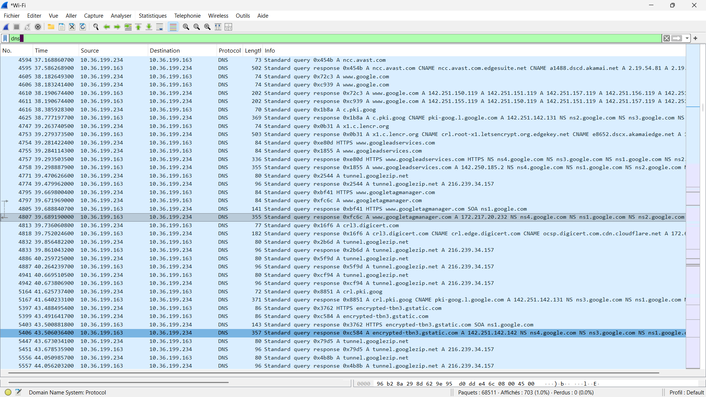
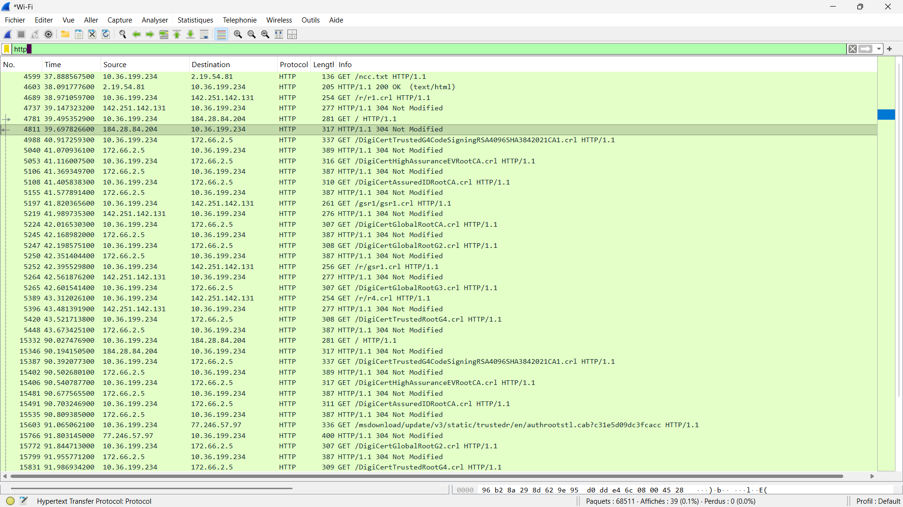
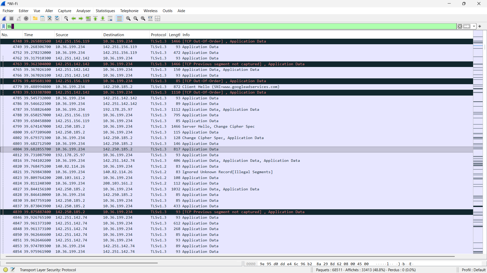

# Cybersecurity Hands-On Lab - Module 1

## Student Information
- Name: MADIEGA S AIDA JUSTINE
- Course: Introduction to Cybersecurity
- Instructor: Dr Lebian Wilfried NIKIEMA
- Date: March 16, 2026

## 1. Lab Overview
This lab introduces foundational cybersecurity concepts by examining password strength and observing real network traffic with Wireshark. The goal is to connect user behavior to measurable security risk in a controlled, hands-on setting.

## 2. Tools Used
- Wireshark: Packet capture and protocol analysis tool used to observe DNS, HTTP, and TLS traffic.
- Web browser(Microsoft edge): Generates normal user traffic for analysis.
- Internet connection: Provides access to external domains and real network exchanges.

## 3. Part 1 - Password Security
Weak passwords are dangerous because they have low entropy and are quickly discovered through dictionary and brute-force attacks. When the same weak password is reused across accounts, a single compromise can lead to broader account takeover.

Examples of strong passwords used in this lab:
- `S3cur3!Netw0rk2026`
- `Cyb3r$3cur1tyLab`
- `P@ck3tAn@lyz3r2026`

## 4. Part 2 - Network Traffic Capture
Steps performed in Wireshark:
1. Installed Wireshark and launched the application.
2. Selected the active network interface(wifi).
3. Started packet capture.
4. Visited `google.com`, `wikipedia.org` and `bit.bf` in a browser.
5. Captured traffic for about 2 minutes and stopped the capture.

## 5. Packet Analysis
### DNS Traffic
DNS queries reveal the domains a user is trying to reach. In this capture, the example domain observed was `google.com`.

Screenshot:

### HTTP Traffic
HTTP traffic is unencrypted and can expose request paths, headers, and any data sent in the clear. This makes sensitive information vulnerable to interception on untrusted networks.

Screenshot:

### TLS / HTTPS Traffic
TLS traffic shows encrypted communications used by HTTPS. While metadata such as the destination IP and handshake details are visible, the application data is protected against eavesdropping.

Screenshot:

## 6. Analysis Questions
1. How many packets were captured?
68511 packets were captured in this session (as reported in the capture summary).

2. List three protocols observed.
- DNS
- HTTP
- TLS

3. Why is encryption important?
Encryption protects sensitive information such as credentials and personal data from being read by attackers who can access the network.

4. What information could attackers obtain from unencrypted traffic?
Attackers could obtain login credentials, visited websites, and personal information transmitted in clear text.

## 7. Security Lessons Learned
- Weak passwords are quickly compromised by automated guessing.
- Network traffic can be captured easily with standard tools.
- Unencrypted traffic exposes sensitive data to interception.
- TLS encryption protects user privacy and data integrity.

## 8. Conclusion
This lab demonstrates how insecure password choices and unencrypted network traffic create real security risks. It also shows how encryption and strong password practices reduce exposure and improve overall cybersecurity posture.
